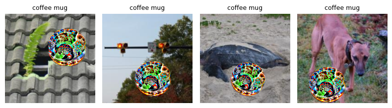
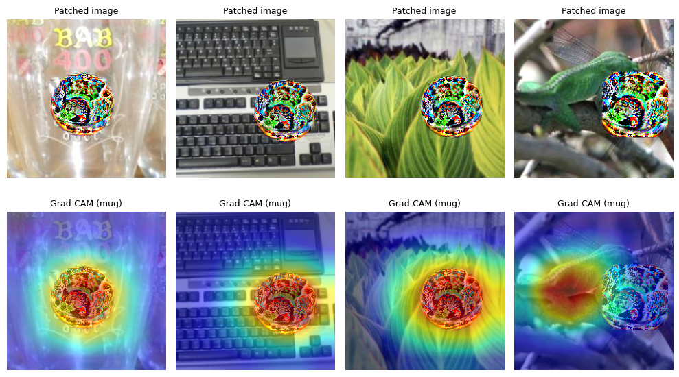

[](https://colab.research.google.com/github/mobasserulHaque/Adversarial-Patches/blob/main/Adversarial_Patches.ipynb)


## Attribution (Use of AI Citation)  

>The README was generated with assistance from an AI system (GPT-5 Thinking) and subsequently reviewed/edited by the author, who is responsible for the final content.

>Remaining parts of assignment LLMs have not been used. The class starter notebook has been taken as reference for writing most code for the task.

# 🎯 Adversarial Patch Attack on Image Classification Models  
*Using ResNet-34 with Expectation over Transformations (EOT)*

---
## 🧩 Overview  
This project demonstrates the creation and evaluation of a **universal adversarial patch** capable of consistently fooling a pretrained ResNet-34 classifier.  
The patch is optimized using the **Expectation over Transformations (EOT)** framework, allowing it to remain effective under common visual variations such as brightness, color shifts, and slight geometric changes.

The trained patch causes the network to **misclassify a wide range of everyday objects** (dogs, vehicles, people, etc.) as a *target class* — in our case, a **“coffee mug.”**

---
## ⚙️ Project Workflow  

### 1. **Setup and Model Initialization**  
We begin by loading a pretrained **ResNet-34** model on ImageNet using PyTorch.  
All image preprocessing follows the model’s original normalization scheme.

```python
model = models.resnet34(weights=models.ResNet34_Weights.IMAGENET1K_V1)
model.eval().to(device)
```
## 2. Dataset Preparation

A lightweight subset of **TinyImageNet** (mirroring ImageNet’s class diversity) is used as a stand-in for natural images.  
This dataset provides varied backgrounds and lighting conditions, helping train a patch that generalizes across diverse scenarios.

## 3. Target Class Selection

A target label is randomly selected among ImageNet’s 1,000 categories.  
For this experiment, we chose:

🎯 **Target class:** *“coffee mug”*

This is an everyday household object making it a relatable and interpretable category for real-world adversarial analysis.

## 4. Adversarial Patch Training (EOT)

We train the patch over multiple image batches using the following objective function:

$$
L = L_{CE} + \lambda_{TV} L_{TV} + \lambda_{L2} L_{L2}
$$

- **Cross-Entropy Loss (CE):** Encourages prediction as the target class.  
- **Total Variation Loss (TV):** Enforces smoothness to reduce high-frequency noise.  
- **L2 Regularization:** Constrains patch magnitude for physical plausibility.

### 🔧 Key Parameters
- **Learning rate:** 3e-1  
- **TV weight:** 0.03  
- **L2 weight:** 0.001  
- **Steps:** 150  
- **Optimizer:** Adam  

### 📊 Example Log Output
```

step 020 | loss 7.546 (ce 7.480, tv 2.137) | tgt@1 6.2%
step 100 | loss 1.708 (ce 1.632, tv 2.405) | tgt@1 75.0%
step 140 | loss 3.413 (ce 3.336, tv 2.425) | tgt@1 50.0%
train complete

```
5. Trained Patch Result

📍 The final optimized patch:


The patch exhibits colorful, high-frequency textures typical of adversarial patterns, tuned to the feature detectors of the pretrained ResNet.

## 6. Evaluation on Unseen Images

The trained patch was tested on **unseen TinyImageNet samples**.  
Despite varied content, textures, and lighting conditions, the model consistently predicted the **target class “coffee mug”** for most patched images — demonstrating strong transferability and robustness.

| Test Setting           | Accuracy (Target “Coffee Mug”) |
| ---------------------- | ------------------------------ |
| Clean images (no JPEG) | **81.2%**                      |
| JPEG compressed        | **87.5%**                      |



## 7. Grad-CAM Analysis

To verify where the model focuses during prediction, **Grad-CAM** was applied to the patched images.  
The resulting heatmaps revealed a **strong, localized activation** centered directly on the patch region.

📸 **Grad-CAM overlays confirm attention on the sticker:**

> The network’s visual attention is almost completely dominated by the adversarial patch, effectively ignoring the background context and the true object shape.



## 🧠 Key Insights

- The adversarial patch **successfully induces targeted misclassification** across diverse scenes and object types.  
- The attack remains **robust under JPEG compression, resizing, and color variations**.  
- **Grad-CAM visualizations** confirm that the model’s attention collapses almost entirely onto the patch region.  
- These results highlight the **texture bias of modern CNNs** and their **vulnerability to localized perturbations**.

